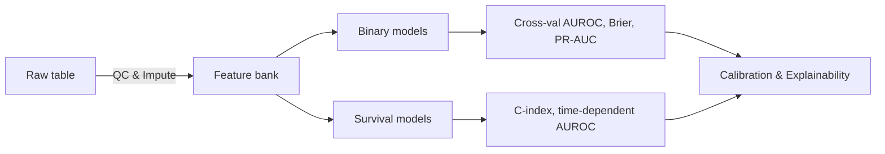

Context of this project :
We are working on analysing and creating data science solutions. Specifically we have extracted patients from MIMIC - IV v3.1 dataset where our cohort has sepsis associated with Acute Kidney Injury (SA-AKI). We have extracted many features from the dataset of those patient including 24 hour aggregations of many time series data. The below 2 columns are only representing the future outcomes -

| Column | Meaning | Unit |
|--------|---------|------|
| `time_to_event_hrs` | Follow‑up: hours to death or last known alive. | h |
| `event_observed` | **1 = in‑hospital death**, 0 = censored survival. | Boolean |

The raw data is in /data folder and 2 files are there which are raw data - data\mimic_saaki_final.csv and data\mimic_saaki_final.xlsx (both are same data, extension is different). 

The data dictionary is as follows :
# **Data Dictionary – `mimic_saaki_final` (SA‑AKI Cohort)**

This document describes **all 356 columns** of the final modelling table used for SA‑AKI mortality/survival analysis.  Each variable has:
* **Meaning** – plain‑language clinical definition.
* **Unit** – canonical unit in MIMIC‑IV / eICU, or *Boolean / categorical* when applicable.
* Max **2–3 explanatory lines** (brevity by design).

Because hundreds of variables share the same statistical **suffixes** (e.g. `_first`, `_auc`) a common legend appears first; the suffix rules apply to every laboratory, vital‑sign, and waveform base name, avoiding redundant prose.

---

## 1 · Suffix legend (applies to every time‑series feature)

| Suffix | Definition | Unit comment |
|--------|------------|--------------|
| `_first`  | First measurement within the first 24 h of ICU stay. | Base unit |
| `_last`   | Last measurement within the same window. | Base unit |
| `_median` | Median of all readings over 24 h. | Base unit |
| `_iqr`    | Inter‑quartile range (Q3 − Q1). | Base unit |
| `_rng`    | Max − Min range. | Base unit |
| `_delta`  | Change = last − first (directional trend). | Base unit |
| `_auc`    | Trapezoidal area‑under‑curve over 24 h. | Base unit × h |
| `_slope`  | Linear regression slope (per hour). | Base unit / h |
| `_n`      | Number of discrete observations. | Count |

*Every column that ends in one of these suffixes inherits its meaning from the combination: **base name** + **suffix meaning** + **unit given in Section 4 or 5**.*

---

## 2 · Identifiers & temporal anchors

| Column | Meaning | Unit |
|--------|---------|------|
| `stay_id` | Unique ICU stay identifier in MIMIC‑IV. | — |
| `subject_id` | Patient identifier across admissions. | — |
| `hadm_id` | Hospital admission ID (links to wards). | — |
| `age` | Age at ICU admission (capped ≥ 89 → 90 in MIMIC). | Years |
| `gender` | Recorded biological sex (`M`, `F`, or *Unknown*). | Categorical |
| `ethnicity` | Ethnicity string from admission note. | Categorical |
| `admission_height` | Height documented on admission. | cm |
| `admission_weight` | Weight documented on admission. | kg |
| `bmi` | Body‑mass‑index derived from height & weight. | kg / m² |
| `aki_onset_delta_hrs` | Hours from ICU in‑time to AKI onset (KDIGO). | h |
| `sepsis_onset_delta_hrs` | Hours from ICU in‑time to first Sepsis‑3 flag. | h |
| `time_to_event_hrs` | Follow‑up: hours to death or last known alive. | h |
| `event_observed` | **1 = in‑hospital death**, 0 = censored survival. | Boolean |

---

## 3 · Therapies & exposure flags

| Column | Meaning | Unit |
|--------|---------|------|
| `mechanical_ventilation_24hr_flag` | Any invasive ventilation in first 24 h. | Boolean |
| `mechvent_time_to_start_hrs` | Hours from ICU admit to first ventilation. | h |
| `vasopressor_24hr_flag` | Vasopressor infusion used in first 24 h. | Boolean |
| `vasopressor_time_to_start_hrs` | Hours to first vasopressor start. | h |
| `rrt_24hr_flag` | Renal‑replacement therapy within 24 h window. | Boolean |
| `baseline_scr_estimated_flag` | Baseline creatinine was estimated (not measured). | Boolean |

---

## 4 · Scores & comorbidities

### 4.1 Severity scores (continuous)

| Column | Meaning | Unit |
|--------|---------|------|
| `apache_iii_score` | Acute Physiology & Chronic Health Evaluation III. | Points |
| `sofa_total_24hr` | Total SOFA score over first day. | Points |
| `sofa_cardiovascular_24hr` | SOFA cardiovascular component. | Points |
| `sofa_coagulation_24hr` | SOFA coagulation component. | Points |
| `sofa_hepatic_24hr` | SOFA hepatic component. | Points |
| `sofa_neurological_24hr` | SOFA neurological component. | Points |
| `sofa_renal_24hr` | SOFA renal component. | Points |
| `sofa_respiratory_24hr` | SOFA respiratory component. | Points |

### 4.2 Charlson comorbidity binary flags

*Each flag = 1 if the diagnosis is present in past history / ICD codes; 0 otherwise.*

`charlson_cancer_flag`, `charlson_chf_flag`, `charlson_copd_flag`, `charlson_cvd_flag`, `charlson_dementia_flag`, `charlson_diabetes_complications_flag`, `charlson_diabetes_flag`, `charlson_hemiplegia_flag`, `charlson_hiv_flag`, `charlson_liver_mild_flag`, `charlson_liver_severe_flag`, `charlson_metastatic_cancer_flag`, `charlson_mi_flag`, `charlson_pud_flag`, `charlson_pvd_flag`, `charlson_renal_flag`, `charlson_rheumatic_flag`

---

## 5 · Fluid balance & urine output

| Column | Meaning | Unit |
|--------|---------|------|
| `fluid_balance_24hr_ml` | Net fluids (inputs − outputs) in first 24 h. | mL |
| `fluid_balance_24hr_ml_perkg` | Same, indexed to admission weight. | mL / kg |
| `urine_output_total_24hr` | Total urine produced in 24 h. | mL |
| `urine_output_total_24hr_perkg` | Weight‑indexed urine output. | mL / kg |
| `urine_output_avg_hourly_24hr` | Mean hourly urine flow in window. | mL / h |

---

## 6 · Vital‑sign base names & units

| Base name | Clinical variable | Unit |
|-----------|------------------|------|
| `heartrate` | Heart rate | beats / min |
| `sysbp` | Systolic arterial pressure | mm Hg |
| `diabp` | Diastolic arterial pressure | mm Hg |
| `meanbp` | Mean arterial pressure | mm Hg |
| `resprate` | Respiratory rate | breaths / min |
| `spo2` | Peripheral capillary O₂ sat. | % |
| `temperature` | Core body temperature | °C |

*Combine each base with any suffix from Section 1 to obtain its exact column.*

---

## 7 · Laboratory base names & units

| Base name | What it measures | Unit |
|-----------|------------------|------|
| `albumin` | Serum albumin | g / dL |
| `alkphos` | Alkaline phosphatase | U / L |
| `alt` | Alanine aminotransferase | U / L |
| `ast` | Aspartate aminotransferase | U / L |
| `aniongap` | Serum anion gap | mmol / L |
| `bicarbonate` | Serum bicarbonate | mmol / L |
| `bun` | Blood urea nitrogen | mg / dL |
| `calcium` | Total serum calcium | mg / dL |
| `chloride` | Serum chloride | mmol / L |
| `creatinine` | Serum creatinine | mg / dL |
| `glucose` | Plasma glucose | mg / dL |
| `hematocrit` | Packed‑cell volume | % |
| `hemoglobin` | Hemoglobin concentration | g / dL |
| `inr` | International Normalised Ratio | — |
| `lactate` | Serum lactate | mmol / L |
| `lymphocytes` | % lymphocytes in WBC diff | % |
| `paco2` | Arterial CO₂ partial pressure | mm Hg |
| `pao2` | Arterial O₂ partial pressure | mm Hg |
| `ph` | Arterial pH | pH units |
| `plateletcount` | Platelet count | 10⁹ / L |
| `potassium` | Serum potassium | mmol / L |
| `pt` | Prothrombin time | s |
| `ptt` | Activated partial thromboplastin time | s |
| `rdw` | Red‑cell distribution width | % |
| `sodium` | Serum sodium | mmol / L |
| `totalbilirubin` | Total serum bilirubin | mg / dL |
| `wbc` | White‑blood‑cell count | 10³ / µL |

*For every laboratory base, append any suffix to reference the exact column, e.g. `creatinine_first`, `bun_auc`, `rdw_slope`, etc.*

---

## 8 · Column lookup example

> **Column name:** `totalbilirubin_iqr`
>
> **Meaning:** Inter‑quartile range of total serum bilirubin values recorded in the first 24 h of ICU stay.
>
> **Unit:** mg/dL.

The same template applies universally once you combine:
* **Base definition** (Sections 6‑7) + 
* **Suffix rule** (Section 1).

What we are trying to achieve with this data ?

## 1 Scope & Objectives

We aim to build a **rigorous, clinically‑grounded pipeline for in‑ICU mortality prediction** in adult sepsis‑associated AKI. The work is strictly limited to

* **Binary end‑point:** `event_observed` (1 = death before discharge, 0 = survival/censoring).
* **Time‑to‑event end‑point:** `time_to_event_hrs` with right‑censoring.

All downstream tasks—feature engineering, model fitting, validation, interpretation—serve these two predictive goals.

---

## 2 Foundational Philosophy

1. **First‑principles reasoning.**  We derive every estimator from its statistical loss or likelihood and articulate underlying assumptions.
2. **Multi‑scale viewpoint.**  Each variable is treated as a thermodynamic “degree of freedom”; global mortality emerges from their interactions.  Statistical‑mechanics analogues (energy, entropy, partition functions) guide feature selection and regularisation.
3. **Transparent uncertainty.**  We propagate aleatoric and epistemic uncertainty via Bayesian or ensemble techniques and report credibility intervals for all performance metrics.

---

## 3 Statistical & Mathematical Toolkit

### 3.1 Classical Hypothesis Testing

| Family                 | Purpose                                                | Tests                                                   |
| ---------------------- | ------------------------------------------------------ | ------------------------------------------------------- |
| *Location*             | Compare lab/vital distributions between outcome groups | Welch t, Mann–Whitney U                                 |
| *Scale*                | Heteroscedasticity checks before GLM                   | Brown–Forsythe, Levene                                  |
| *Association*          | Binary ↔ continuous links                              | Point‑biserial $\rho_{pb}$, χ², Fisher exact            |
| *Proportional hazards* | Validate Cox assumption                                | Schoenfeld residual χ², time‑dependent β(t) spline test |

### 3.2 Parametric & Semi‑Parametric Survival Models

| Model                           | Key equation                              | Notes                                       |                                          |
| ------------------------------- | ----------------------------------------- | ------------------------------------------- | ---------------------------------------- |
| **Exponential / Weibull**       | $h(t)=\lambda p(\lambda t)^{p-1}$         | baseline shape diagnostics via log‑log plot |                                          |
| **Cox PH (elastic‑net)**        | (h(t                                      | \mathbf x)=h\_0(t)\exp(\mathbf x^T\beta))   | λ grid → nested CV for optimal l₁/l₂ mix |
| **AFT‑Gaussian & log‑logistic** | $\ln T=\mathbf x^T\beta+\sigma\epsilon$   | handles non‑PH patterns                     |                                          |
| **DeepSurv**                    | $\beta(\mathbf x)=f_{\theta}(\mathbf x)$  | trained with negative partial likelihood    |                                          |
| **SurvFormer**                  | transformer encoder on raw feature tokens | long‑range feature interactions             |                                          |

### 3.3 Binary Classification Counterparts

* **Logit & probit GLM** — baseline, interpretable coefficients.
* **Gradient‑boosted decision trees** — non‑linear, mixed‑type features.
* **Bayesian additive regression trees (BART)** — full posterior over $p(\text{death}|\mathbf x)$.
* **Energy‑based MaxEnt score** — Lagrange multipliers match observed first/second moments.

### 3.4 Assumption & Robustness Batteries

* **Multicollinearity:** variance‑inflation factor (VIF), condition number.
* **Functional‑form adequacy:** component‑plus‑residual (CR) plots, GAM partial‑dependence.
* **Outlier leverage:** Cook’s distance, robust M‑estimators.
* **Missing‑data mechanism:** Little’s MCAR, logistic MAR test; explicit modelling of missingness indicators.

---

## 4 Feature‑Specific Modelling Protocol

For every column that survives the >95 %‑missing filter we will:

1. **Contextualise** clinical relevance (renal, haemodynamic, liver, etc.).
2. **Visualise** outcome‑stratified distribution (histogram, violin).
3. **Transform** (Box‑Cox, log, standardise) if distributional tests demand.
4. **Hypothesis‑test** mean/median difference vs mortality.
5. **Assess PH compatibility** (for survival) via scaled Schoenfeld residuals.
6. **Derive energy term** λᵢ for MaxEnt baseline; store in coefficient registry.

A living markdown table (see *Changelog*) will record each variable’s transformation, test p‑values, and modelling role.

---

## 5 Model‑Fitting Workflow

## 6 Evaluation Metrics & Targets

| Metric               | Binary Target                | Survival Target                 |
| -------------------- | ---------------------------- | ------------------------------- |
| AUROC                | ≥ 0.82                       | time‑dep AUROC (24 h) ≥ 0.80    |
| Brier score          | ≤ 0.06                       | Integrated ≤ 0.15               |
| Calibration slope    | 0.9–1.1                      | —                               |
| C‑index              | —                            | ≥ 0.82                          |
| Net clinical benefit | Decision‑curve @ risk ≥ 10 % | Decision‑curve at 7‑day horizon |

---

## 7 Reproducibility & Governance

* **Changelog.md** — list any and every changes properly with a summary in this file with a version number. If this file is empty start with v1.0.0
* **Fairness audits** — AUROC parity across gender/ethnicity; Δ ≤ 0.05.
* **Sensitivity analyses** — jack‑knife on high‑leverage cases; missing‑rate upweighting.

*Let us proceed methodically, documenting each statistical decision with precision and mathematical clarity.*

Maintain a file called plan.md which will contain everything that we are planning to do in future, and present. And the past is recorded in changelog.md
